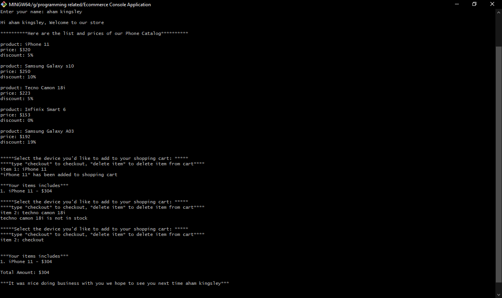

# E-Commerce Console Application

This is an E-commerce app that runs only on terminal. A user can add items to cart, view items in cart, delete items in cart and also checkout.

### Screenshot:



### Link to online demo

- [E-commerce Console App](https://react-invoice-app-proj.netlify.app/)

### Adding And Deleting Item from Cart

Adding Item to Cart:

- Type in the item full name. the name is case insensitive

Deleting Item from Cart

- Type delete followed by the item full name to delete an item from cart

### Author

- Portfolio - [Kingsleyaham](https://github.com/Kingsleyaham/)
- Linkedin - [Kingsley Aham](https://www.linkedin.com/in/kingsley-aham-282a51225/)
- Twitter - [Aham Kingsley](https://twitter.com/aham_kingsley8/)

### Run the Code on Terminal

```
npm run start
```
